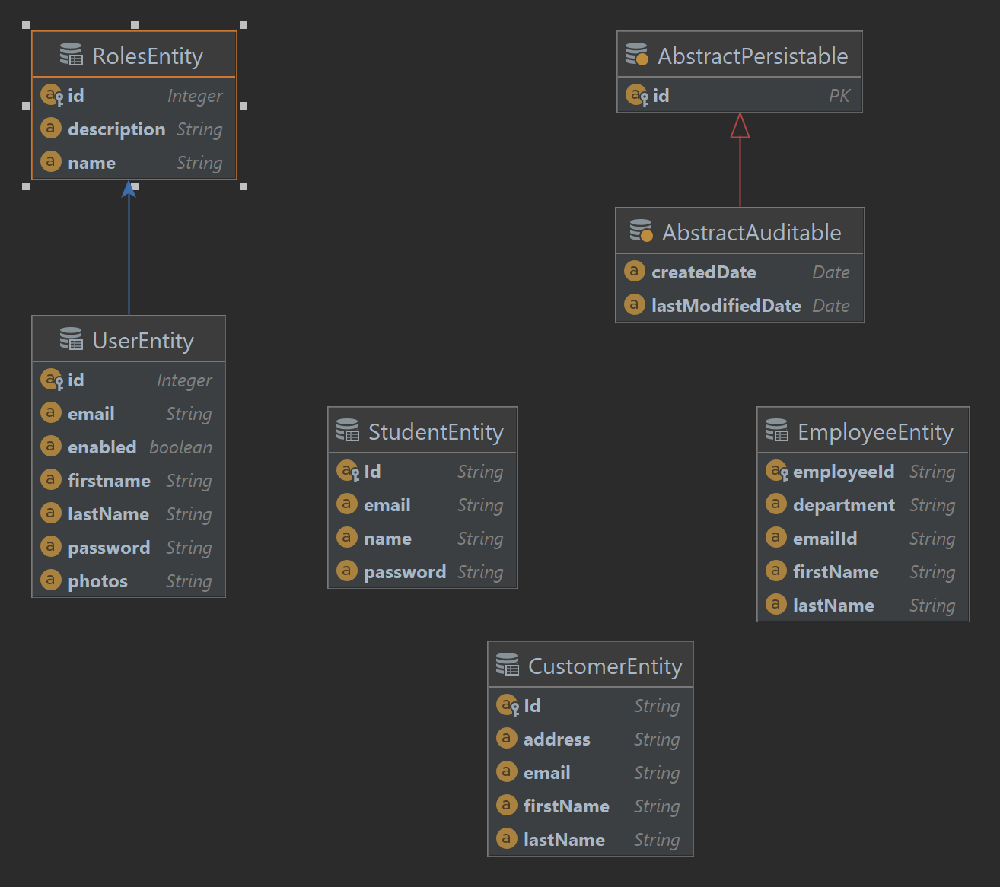

# Spring boot from soup to nut including projects
In this project, you will learn all the nitty-gritties of spring boot and walk away
as a geek and confident backend java engineer

# Below is the Project structure of the JPA part

