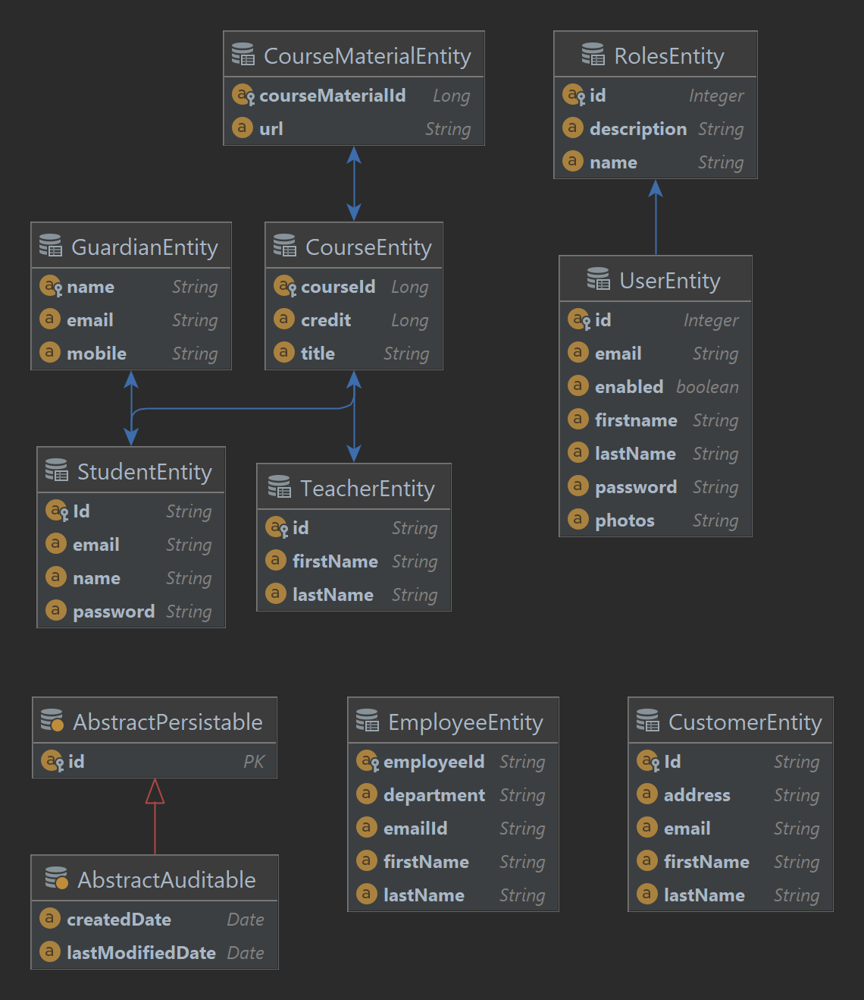

# Product Microservice

# Spring boot from soup to nut including projects
In this project, you will learn all the nitty-gritties of spring boot and walk away
as a geek and confident backend java engineer

# Below is the Project structure of the JPA part

# Database
Please note that I am using MYSQL database for all this project and consider using the same
to avoid incompatibility issue. 

# There is also a frontend implemented in REACTJS
What is React summary?
React is a JavaScript-based UI development library. 
Facebook and an open-source developer community run it. 
Although React is a library rather than a language, it is widely used in web development. 
The library first appeared in May 2013 and is now one of the most commonly used frontend libraries for web development.

# What are we going to use REACT for in our spring boot project ?
  1. To implement a simple product management application
  2. The frontend will use React and the backend will use Spring boot
  3. We'll use axios js, a promise based library that will help us fetch our API
  4. We will also set the cross-origin in our spring boot application to enabled smooth communication
     between the back and front end using the @CrossOrigin annotation
  5. This application is for practical purpose only

# You can read more about spring boot, React and axios js below
  a. Spring boot official website: <a href='https://spring.io/projects/spring-boot/'>Learn Spring boot</a>
  b. React official website: <a href='https://react.dev/'>Learn React</a>
  c. Axios official website: <a href='https://axios-http.com/docs/intro'>Axios </a>

# Contributing
  Anyone can be a contributor to this repo with just a simple step, clone this repo and 
  make the neccessary contribution. I will review afterwards and merge it. 

# Contact and Address
  
  I am currently based in China and you can easily reach me through twitter here: https://twitter.com/ousmanesangary2/

